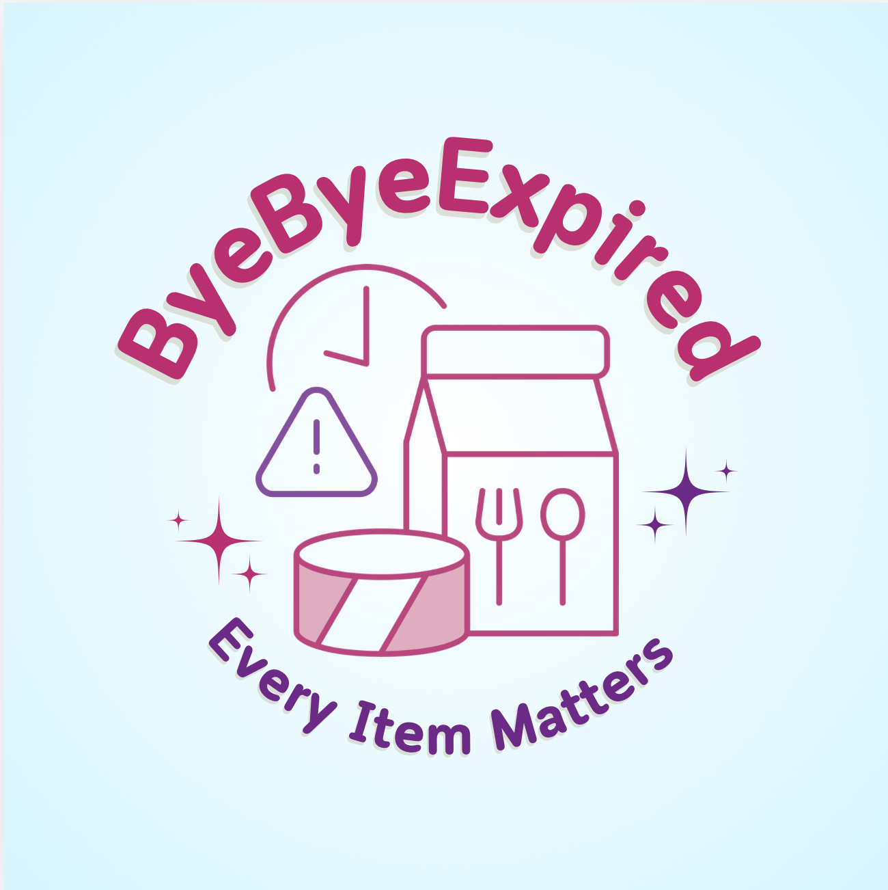

# 🥫 ByeByeExpired

<p align="center">
  
</p>

<p align="center">
  <strong>แอปพลิเคชันจัดการวันหมดอายุอาหารและวัตถุดิบ</strong>
  <br>
  <em>Track your food expiration dates, reduce waste, and save money!</em>
</p>

<p align="center">
  <a href="#-features">Features</a> •
  <a href="#-tech-stack">Tech Stack</a> •
  <a href="#-project-structure">Structure</a> •
  <a href="#-installation">Installation</a> •
  <a href="#-api-documentation">API Docs</a>
</p>

---

## 📖 เกี่ยวกับโปรเจกต์ (About)

**ByeByeExpired** เป็นแอปพลิเคชันมือถือที่ช่วยให้คุณจัดการวันหมดอายุของอาหารและวัตถุดิบได้อย่างมีประสิทธิภาพ
ไม่ว่าจะเป็นการใช้งานส่วนตัวที่บ้าน หรือใช้ในธุรกิจร้านอาหาร

แอปนี้ช่วยให้คุณ:
- ลดการสูญเสียอาหารจากการหมดอายุ
- ประหยัดเงินจากการไม่ทิ้งอาหารโดยไม่จำเป็น
- วางแผนการใช้วัตถุดิบได้ดียิ่งขึ้น
- ติดตามต้นทุนและความสูญเสียได้ชัดเจน

---

## ✨ Features

### 🔐 ระบบยืนยันตัวตน (Authentication)

| Feature | Description |
|---------|-------------|
| **สมัครสมาชิกด้วยอีเมล** | ลงทะเบียนด้วยอีเมลและรหัสผ่าน พร้อมยืนยันอีเมล OTP |
| **เข้าสู่ระบบด้วย Google** | OAuth 2.0 สำหรับการเข้าสู่ระบบแบบรวดเร็ว |
| **ยืนยันอีเมล** | ส่ง OTP 6 หลักไปยังอีเมลเพื่อยืนยันตัวตน |
| **จัดการโปรไฟล์** | แก้ไขข้อมูลส่วนตัว ชื่อ และรูปโปรไฟล์ |

### 📦 การจัดการสินค้า (Product Management)

| Feature | Description |
|---------|-------------|
| **เพิ่มสินค้าด้วยบาร์โค้ด** | สแกนบาร์โค้ดด้วยกล้องเพื่อเพิ่มสินค้าอัตโนมัติ |
| **เพิ่มสินค้าแบบ Manual** | กรอกข้อมูลสินค้าด้วยตนเอง |
| **Product Templates** | ระบบจำข้อมูลสินค้าที่เคยบันทึก ใช้ซ้ำได้ |
| **จัดหมวดหมู่สินค้า** | ผัก&ผลไม้, เนื้อสัตว์, ไข่&นม, อาหารแปรรูป, เครื่องดื่ม |
| **ตั้งวันหมดอายุ** | กำหนดวันหมดอายุและวันเตือนล่วงหน้า |
| **จำนวนและราคา** | บันทึกจำนวนและราคาต่อหน่วย |
| **รูปภาพสินค้า** | อัปโหลดรูปภาพประกอบ |

### 🏠 การจัดการสถานที่ (Location Management)

| Feature | Description |
|---------|-------------|
| **Personal Location** | สถานที่ส่วนตัว เช่น บ้าน อพาร์ทเมนต์ |
| **Business Location** | สถานที่ธุรกิจ เช่น ร้านอาหาร คาเฟ่ |
| **สลับสถานที่** | เปลี่ยนระหว่างสถานที่ได้อย่างง่ายดาย |
| **สร้างสถานที่ใหม่** | เพิ่มสถานที่จัดเก็บได้ไม่จำกัด |
| **เชิญสมาชิก** | แชร์การจัดการกับผู้อื่นได้ |
| **จัดการสิทธิ์** | กำหนด Role: Owner, Member |

### 🧊 การจัดการที่เก็บ (Storage Management)

| Feature | Description |
|---------|-------------|
| **Freezer** | พื้นที่แช่แข็ง |
| **Fridge** | ตู้เย็น |
| **Dry Food** | อาหารแห้ง |
| **Custom Storage** | สร้างที่เก็บเองได้ |
| **เลือกไอคอนและสี** | Customize ที่เก็บแต่ละอัน |
| **นับจำนวนสินค้า** | แสดงจำนวนสินค้าในแต่ละที่เก็บ |
| **ย้ายสินค้า** | ย้ายสินค้าระหว่างที่เก็บได้ |

### 🔔 ระบบแจ้งเตือน (Notification System)

| Feature | Description |
|---------|-------------|
| **แจ้งเตือนใกล้หมดอายุ** | แจ้งเตือนล่วงหน้าก่อนสินค้าหมดอายุ |
| **แจ้งเตือน Low Stock** | แจ้งเตือนเมื่อสินค้าใกล้หมด (Business Mode) |
| **ตั้งค่าวันเตือน** | กำหนดจำนวนวันก่อนหมดอายุที่ต้องการเตือน |
| **ดูรายการแจ้งเตือน** | Notification Overlay แสดงรายการทั้งหมด |

### 📊 Dashboard & Analytics

| Feature | Description |
|---------|-------------|
| **กราฟแท่ง (Bar Chart)** | แสดงมูลค่าสินค้าที่สูญเสียรายเดือน |
| **กราฟวงกลม (Pie Chart)** | แสดงสัดส่วนความสูญเสียตามหมวดหมู่ |
| **กรองตามเดือน/ปี** | เลือกดูข้อมูลตามช่วงเวลา |
| **สรุปต้นทุน** | รวมมูลค่าความสูญเสียทั้งหมด (THB) |
| **Nearly Expired View** | ดูรายการสินค้าใกล้หมดอายุ |
| **Expired View** | ดูรายการสินค้าหมดอายุแล้ว |

### 🏪 Supplier Management (Business Mode)

| Feature | Description |
|---------|-------------|
| **เพิ่มซัพพลายเออร์** | บันทึกข้อมูลผู้จัดจำหน่าย |
| **ข้อมูลติดต่อ** | ชื่อ, ที่อยู่, เบอร์โทร, อีเมล |
| **เชื่อมโยงกับสินค้า** | ระบุ Supplier ของแต่ละสินค้า |
| **ดูรายละเอียด** | ดูประวัติการสั่งซื้อจาก Supplier |

### 📸 Barcode Scanning

| Feature | Description |
|---------|-------------|
| **Real-time Scanning** | สแกนบาร์โค้ดแบบเรียลไทม์ |
| **Haptic Feedback** | สั่นเมื่อสแกนสำเร็จ |
| **Beep Sound** | เสียงแจ้งเตือนเมื่อสแกนสำเร็จ |
| **Auto-fill** | กรอกข้อมูลอัตโนมัติจาก Product Template |
| **Torch/Flash** | เปิดไฟฉายสำหรับสแกนในที่มืด |

---

## 🛠 Tech Stack

### Frontend

| Technology | Purpose |
|------------|---------|
|  | Cross-platform Mobile Framework |
|  | Development Platform & Build Tools |
|  | Type-safe JavaScript |
|  | File-based Navigation |
|  | Navigation Library |

### Frontend Libraries

```
📦 UI & Animation
├── expo-linear-gradient     → Gradient backgrounds
├── react-native-reanimated  → Smooth animations
├── react-native-svg         → SVG charts & icons
├── @expo/vector-icons       → Icon library
└── expo-blur                → Blur effects

📷 Camera & Media
├── expo-camera              → Barcode scanning
├── expo-image-picker        → Image selection
├── expo-image-manipulator   → Image processing
├── expo-av                  → Audio playback
└── expo-haptics             → Vibration feedback

🔐 Authentication & Storage
├── @supabase/supabase-js    → Supabase client
├── @react-native-async-storage → Local storage
├── expo-auth-session        → OAuth handling
└── expo-web-browser         → External auth flows

📅 UI Components
├── @react-native-community/datetimepicker → Date picker
├── @react-native-picker/picker            → Dropdown picker
└── expo-status-bar                        → Status bar control
```

### Backend

| Technology | Purpose |
|------------|---------|
|  | Runtime Environment |
|  | Web Framework |
|  | Type-safe Development |
|  | Database & Auth |

### Backend Libraries

```
📦 Core
├── express          → Web server framework
├── cors             → Cross-Origin Resource Sharing
├── dotenv           → Environment variables
└── axios            → HTTP client

🔧 Development
├── nodemon          → Hot reload development
├── ts-node          → TypeScript execution
├── @types/express   → Express type definitions
└── @types/node      → Node.js type definitions
```

### Database

| Service | Purpose |
|---------|---------|
|  | Database & Authentication |
| **PostgreSQL** | Relational Database |
| **Supabase Auth** | User Authentication |
| **Supabase Storage** | File/Image Storage |
| **Row Level Security** | Data Protection |

---

## 📁 Project Structure

```
ByeByeExpired_Project/
│
├── 📂 BackEnd/                          # Express.js Backend
│   ├── 📄 package.json                  # Backend dependencies
│   ├── 📄 tsconfig.json                 # TypeScript config
│   │
│   └── 📂 src/
│       ├── 📄 app.ts                    # Express app setup
│       ├── 📄 index.ts                  # Server entry point
│       ├── 📄 supabase.ts               # Supabase client
│       │
│       ├── 📂 middleware/               # Express middlewares
│       │   ├── auth.middleware.ts       # JWT authentication
│       │   └── locationRole.middleware.ts # Role-based access
│       │
│       ├── 📂 routes/                   # API routes
│       │   ├── auth.route.ts            # /auth/*
│       │   ├── barcode.route.ts         # /barcode/*
│       │   ├── health.route.ts          # /health
│       │   ├── location.route.ts        # /api/locations/*
│       │   ├── manageLocation.route.ts  # /api/manage-location/*
│       │   ├── notification.route.ts    # /api/notifications/*
│       │   ├── product.route.ts         # /products/*
│       │   ├── profile.route.ts         # /profile/*
│       │   ├── storage.route.ts         # /api/storages/*
│       │   └── supplier.route.ts        # /api/suppliers/*
│       │
│       ├── 📂 services/                 # Business logic
│       │   ├── auth.service.ts          # Authentication logic
│       │   ├── barcode.service.ts       # Barcode lookup
│       │   ├── location.service.ts      # Location CRUD
│       │   ├── manageLocation.service.ts # Member management
│       │   ├── notification.service.ts  # Notification logic
│       │   ├── product.service.ts       # Product CRUD
│       │   ├── profile.service.ts       # Profile management
│       │   ├── storage.service.ts       # Storage CRUD
│       │   └── supplier.service.ts      # Supplier CRUD
│       │
│       └── 📂 types/                    # TypeScript types
│           ├── auth-request.ts          # Auth request types
│           ├── barcode.ts               # Barcode types
│           ├── product.ts               # Product types
│           ├── storage.ts               # Storage types
│           └── supplier.ts              # Supplier types
│
├── 📂 FrontEnd/
│   └── 📂 ByeByeExpired/               # React Native Expo App
│       ├── 📄 App.js                    # App entry (fallback)
│       ├── 📄 app.json                  # Expo configuration
│       ├── 📄 package.json              # Frontend dependencies
│       ├── 📄 tsconfig.json             # TypeScript config
│       │
│       ├── 📂 app/                      # Screens (Expo Router)
│       │   ├── _layout.tsx              # Root layout
│       │   ├── index.tsx                # Splash/Entry screen
│       │   │
│       │   ├── 🔐 login.tsx             # Login screen
│       │   ├── 🔐 Register.tsx          # Registration screen
│       │   ├── 🔐 confirm-email.tsx     # Email OTP verification
│       │   │
│       │   ├── 🏠 overview.tsx          # Main overview screen
│       │   ├── 📊 Dashboard.tsx         # Analytics dashboard
│       │   ├── ⚠️ NearlyExpired.tsx     # Near expiry list
│       │   ├── ❌ Expired.tsx           # Expired items list
│       │   │
│       │   ├── 📦 addProductPersonal.tsx    # Add product (personal)
│       │   ├── 📦 addProductBusiness.tsx    # Add product (business)
│       │   ├── 📦 allProduct.tsx            # All products list
│       │   ├── 📦 showDetailPersonal.tsx    # Product detail (personal)
│       │   ├── 📦 showDetailBusiness.tsx    # Product detail (business)
│       │   ├── 📦 showList.tsx              # Product list view
│       │   ├── 🗑️ deleteProduct.tsx        # Delete product
│       │   │
│       │   ├── 📷 scanBarcode.tsx       # Barcode scanner
│       │   │
│       │   ├── 🏠 addLocation.tsx       # Add new location
│       │   ├── 🏠 manageLocation.tsx    # Manage location members
│       │   │
│       │   ├── 🧊 storage.tsx           # Storage overview
│       │   ├── 🧊 addStorage.tsx        # Add new storage
│       │   │
│       │   ├── 🏪 supplier.tsx          # Supplier list
│       │   ├── 🏪 addSupplier.tsx       # Add new supplier
│       │   ├── 🏪 detailSupplier.tsx    # Supplier details
│       │   │
│       │   ├── 👤 profile.tsx           # User profile
│       │   ├── ⚙️ setting.tsx           # App settings
│       │   │
│       │   ├── 📄 load.tsx              # Loading screen
│       │   └── 🧪 devtest.tsx           # Development testing
│       │
│       ├── 📂 assets/
│       │   ├── 📂 images/               # App icons & images
│       │   └── 📂 sounds/
│       │       └── beep.ts              # Scan beep sound
│       │
│       ├── 📂 components/               # Reusable components
│       │   ├── BusinessOverview.tsx     # Business mode overview
│       │   ├── PersonalOverview.tsx     # Personal mode overview
│       │   ├── NotificationOverlay.tsx  # Notification popup
│       │   ├── external-link.tsx        # External link handler
│       │   ├── haptic-tab.tsx           # Haptic feedback tab
│       │   ├── hello-wave.tsx           # Wave animation
│       │   ├── parallax-scroll-view.tsx # Parallax scrolling
│       │   ├── themed-text.tsx          # Themed text component
│       │   ├── themed-view.tsx          # Themed view component
│       │   │
│       │   └── 📂 ui/                   # UI components
│       │       ├── collapsible.tsx      # Collapsible section
│       │       ├── icon-symbol.tsx      # Icon wrapper
│       │       └── icon-symbol.ios.tsx  # iOS specific icon
│       │
│       ├── 📂 constants/
│       │   ├── storageIcons.ts          # Storage icon definitions
│       │   └── theme.ts                 # Color & theme constants
│       │
│       ├── 📂 hooks/                    # Custom React hooks
│       │   ├── use-color-scheme.ts      # Color scheme detection
│       │   ├── use-color-scheme.web.ts  # Web color scheme
│       │   └── use-theme-color.ts       # Theme color hook
│       │
│       └── 📂 src/
│           ├── 📄 supabase.ts           # Supabase client config
│           │
│           ├── 📂 api/                  # API client functions
│           │   ├── auth.api.ts          # Auth API calls
│           │   ├── barcode.api.ts       # Barcode API calls
│           │   ├── location.api.ts      # Location API calls
│           │   ├── manageLocation.api.ts # Member API calls
│           │   ├── notification.api.ts  # Notification API calls
│           │   ├── product.api.ts       # Product API calls
│           │   ├── profile.api.ts       # Profile API calls
│           │   ├── storage.api.ts       # Storage API calls
│           │   └── supplier.api.ts      # Supplier API calls
│           │
│           ├── 📂 config/               # App configuration
│           ├── 📂 context/              # React Context providers
│           └── 📂 utils/                # Utility functions
│
└── 📄 README.md                         # This file
```

---

## 🚀 Installation

### Prerequisites

ก่อนเริ่มต้น ตรวจสอบว่าคุณมีสิ่งเหล่านี้แล้ว:

```bash
# ตรวจสอบ Node.js (ต้องการ v18+)
node --version

# ตรวจสอบ npm
npm --version

# ติดตั้ง Expo CLI (ถ้ายังไม่มี)
npm install -g expo-cli
```

### 1. Clone Repository

```bash
# Clone โปรเจกต์
git clone https://github.com/GKanakorn/ByeByeExpired_Project.git

# เข้าไปใน directory
cd ByeByeExpired_Project
```

### 2. Setup Backend

```bash
# เข้าไปใน Backend directory
cd BackEnd

# ติดตั้ง dependencies
npm install

# สร้างไฟล์ environment variables
cp .env.example .env
```

แก้ไขไฟล์ `.env`:

```env
# Supabase Configuration
SUPABASE_URL=your_supabase_project_url
SUPABASE_ANON_KEY=your_supabase_anon_key
SUPABASE_SERVICE_ROLE_KEY=your_supabase_service_role_key

# Server Configuration
PORT=3000
```

### 3. Setup Frontend

```bash
# เข้าไปใน Frontend directory
cd ../FrontEnd/ByeByeExpired

# ติดตั้ง dependencies
npm install

# สร้างไฟล์ environment variables
```

สร้างไฟล์ `src/config/env.ts`:

```typescript
export const ENV = {
  SUPABASE_URL: 'your_supabase_project_url',
  SUPABASE_ANON_KEY: 'your_supabase_anon_key',
  API_URL: 'http://your-backend-url:3000',
}
```

### 4. Setup Supabase Database

สร้างตารางในฐานข้อมูล Supabase:

```sql
-- Users Profile
CREATE TABLE profiles (
  id UUID REFERENCES auth.users(id) PRIMARY KEY,
  email TEXT UNIQUE,
  full_name TEXT,
  avatar_url TEXT,
  created_at TIMESTAMP WITH TIME ZONE DEFAULT NOW(),
  updated_at TIMESTAMP WITH TIME ZONE DEFAULT NOW()
);

-- Locations (บ้าน / ร้านอาหาร)
CREATE TABLE locations (
  id UUID DEFAULT gen_random_uuid() PRIMARY KEY,
  name TEXT NOT NULL,
  type TEXT CHECK (type IN ('personal', 'business')),
  owner_id UUID REFERENCES auth.users(id),
  created_at TIMESTAMP WITH TIME ZONE DEFAULT NOW()
);

-- Location Members
CREATE TABLE location_members (
  id UUID DEFAULT gen_random_uuid() PRIMARY KEY,
  user_id UUID REFERENCES auth.users(id),
  location_id UUID REFERENCES locations(id) ON DELETE CASCADE,
  role TEXT CHECK (role IN ('owner', 'member')),
  created_at TIMESTAMP WITH TIME ZONE DEFAULT NOW(),
  UNIQUE(user_id, location_id)
);

-- Storages (ตู้เย็น / ช่องแช่แข็ง)
CREATE TABLE storages (
  id UUID DEFAULT gen_random_uuid() PRIMARY KEY,
  name TEXT NOT NULL,
  icon TEXT,
  color TEXT,
  location_id UUID REFERENCES locations(id) ON DELETE CASCADE,
  created_at TIMESTAMP WITH TIME ZONE DEFAULT NOW()
);

-- Product Templates (ข้อมูลสินค้ากลาง)
CREATE TABLE product_templates (
  id UUID DEFAULT gen_random_uuid() PRIMARY KEY,
  barcode TEXT UNIQUE,
  name TEXT,
  category TEXT,
  default_storage TEXT,
  image_url TEXT,
  created_at TIMESTAMP WITH TIME ZONE DEFAULT NOW()
);

-- Products (สินค้าของแต่ละ user)
CREATE TABLE products (
  id UUID DEFAULT gen_random_uuid() PRIMARY KEY,
  template_id UUID REFERENCES product_templates(id),
  user_id UUID REFERENCES auth.users(id),
  location_id UUID REFERENCES locations(id),
  storage_id UUID REFERENCES storages(id),
  quantity INTEGER DEFAULT 1,
  price DECIMAL(10,2),
  storage_date DATE,
  expiration_date DATE,
  notify_enabled BOOLEAN DEFAULT false,
  notify_before_days INTEGER,
  notify_date TIMESTAMP WITH TIME ZONE,
  low_stock_enabled BOOLEAN DEFAULT false,
  low_stock_threshold INTEGER,
  supplier_id UUID REFERENCES suppliers(id),
  status TEXT DEFAULT 'active',
  created_at TIMESTAMP WITH TIME ZONE DEFAULT NOW(),
  updated_at TIMESTAMP WITH TIME ZONE DEFAULT NOW()
);

-- Suppliers (ผู้จัดจำหน่าย)
CREATE TABLE suppliers (
  id UUID DEFAULT gen_random_uuid() PRIMARY KEY,
  user_id UUID REFERENCES auth.users(id),
  name TEXT NOT NULL,
  address TEXT,
  phone TEXT,
  email TEXT,
  notes TEXT,
  created_at TIMESTAMP WITH TIME ZONE DEFAULT NOW(),
  updated_at TIMESTAMP WITH TIME ZONE DEFAULT NOW()
);
```

---

## ▶️ Running the App

### Start Backend Server

```bash
# Development mode (with hot reload)
cd BackEnd
npm run dev

# Production mode
npm start
```

Backend จะรันที่ `http://localhost:3000`

### Start Frontend App

```bash
# เข้าไปใน Frontend directory
cd FrontEnd/ByeByeExpired

# Start Expo development server
npm start

# หรือใช้ tunnel mode (แนะนำ)
npm run start
```

หลังจากนั้น:
1. สแกน QR Code ด้วย **Expo Go** app บนมือถือ
2. หรือกด `i` สำหรับ iOS Simulator
3. หรือกด `a` สำหรับ Android Emulator

---

## 📡 API Documentation

### Authentication Routes (`/auth`)

| Method | Endpoint | Description |
|--------|----------|-------------|
| `POST` | `/auth/register` | ลงทะเบียนผู้ใช้ใหม่ |
| `POST` | `/auth/login` | เข้าสู่ระบบ |
| `POST` | `/auth/verify-otp` | ยืนยัน OTP จากอีเมล |
| `POST` | `/auth/resend-otp` | ส่ง OTP ใหม่ |
| `POST` | `/auth/verify-google` | ยืนยัน Google OAuth |
| `POST` | `/auth/logout` | ออกจากระบบ |

### Product Routes (`/products`)

| Method | Endpoint | Description |
|--------|----------|-------------|
| `GET` | `/products` | ดึงรายการสินค้าทั้งหมด |
| `GET` | `/products/:id` | ดึงรายละเอียดสินค้า |
| `POST` | `/products` | เพิ่มสินค้าใหม่ |
| `PATCH` | `/products/:id` | แก้ไขสินค้า |
| `DELETE` | `/products/:id` | ลบสินค้า |
| `DELETE` | `/products` | ลบหลายสินค้า (bulk) |

### Location Routes (`/api/locations`)

| Method | Endpoint | Description |
|--------|----------|-------------|
| `GET` | `/api/locations` | ดึงรายการสถานที่ทั้งหมด |
| `POST` | `/api/locations` | สร้างสถานที่ใหม่ |
| `DELETE` | `/api/locations/:id` | ลบสถานที่ |

### Storage Routes (`/api/storages`)

| Method | Endpoint | Description |
|--------|----------|-------------|
| `GET` | `/api/storages/:locationId` | ดึงที่เก็บตาม Location |
| `POST` | `/api/storages` | สร้างที่เก็บใหม่ |
| `PATCH` | `/api/storages/:id` | แก้ไขที่เก็บ |
| `DELETE` | `/api/storages/:id` | ลบที่เก็บ |

### Barcode Routes (`/barcode`)

| Method | Endpoint | Description |
|--------|----------|-------------|
| `GET` | `/barcode/lookup/:code` | ค้นหาข้อมูลจากบาร์โค้ด |

### Supplier Routes (`/api/suppliers`)

| Method | Endpoint | Description |
|--------|----------|-------------|
| `GET` | `/api/suppliers` | ดึงรายการ Supplier |
| `GET` | `/api/suppliers/:id` | ดึงรายละเอียด Supplier |
| `POST` | `/api/suppliers` | เพิ่ม Supplier ใหม่ |
| `PATCH` | `/api/suppliers/:id` | แก้ไข Supplier |
| `DELETE` | `/api/suppliers/:id` | ลบ Supplier |

### Notification Routes (`/api/notifications`)

| Method | Endpoint | Description |
|--------|----------|-------------|
| `GET` | `/api/notifications` | ดึงรายการแจ้งเตือนทั้งหมด |

### Profile Routes (`/profile`)

| Method | Endpoint | Description |
|--------|----------|-------------|
| `GET` | `/profile` | ดึงข้อมูลโปรไฟล์ |
| `PATCH` | `/profile` | อัปเดตโปรไฟล์ |
| `POST` | `/profile/avatar` | อัปโหลดรูปโปรไฟล์ |

### Manage Location Routes (`/api/manage-location`)

| Method | Endpoint | Description |
|--------|----------|-------------|
| `GET` | `/api/manage-location/:id/members` | ดึงรายชื่อสมาชิก |
| `POST` | `/api/manage-location/:id/invite` | เชิญสมาชิกใหม่ |
| `PATCH` | `/api/manage-location/:id/members/:memberId` | แก้ไข Role สมาชิก |
| `DELETE` | `/api/manage-location/:id/members/:memberId` | ลบสมาชิก |

---

## 🔐 Environment Variables

### Backend `.env`

```env
# Supabase
SUPABASE_URL=https://xxxx.supabase.co
SUPABASE_ANON_KEY=eyJhbGciOiJIUzI1NiIsInR5cCI6IkpXVCJ9...
SUPABASE_SERVICE_ROLE_KEY=eyJhbGciOiJIUzI1NiIsInR5cCI6IkpXVCJ9...

# Server
PORT=3000
NODE_ENV=development
```

### Frontend Configuration

สร้างไฟล์ `src/config/env.ts`:

```typescript
export const ENV = {
  // Supabase
  SUPABASE_URL: 'https://xxxx.supabase.co',
  SUPABASE_ANON_KEY: 'eyJhbGciOiJIUzI1NiIsInR5cCI6IkpXVCJ9...',
  
  // Backend API
  API_URL: 'http://192.168.x.x:3000',  // ใช้ IP จริงของเครื่อง
}
```

---

## 📱 App Screens

### Authentication Flow
```
📱 Splash Screen
    ↓
📱 Login Screen ←────────────────┐
    ↓               ↓            │
📱 Register     📱 Google OAuth  │
    ↓                            │
📱 Confirm Email (OTP) ──────────┘
    ↓
📱 Overview (Main)
```

### Main Navigation
```
📱 Overview (Home)
    │
    ├── 📊 Dashboard (Analytics)
    │
    ├── 📦 Products
    │   ├── All Products
    │   ├── Nearly Expired
    │   ├── Expired
    │   └── Add Product
    │       └── 📷 Scan Barcode
    │
    ├── 🧊 Storages
    │   ├── Storage List
    │   └── Add Storage
    │
    ├── 🏠 Locations
    │   ├── Switch Location
    │   ├── Add Location
    │   └── Manage Members
    │
    ├── 🏪 Suppliers (Business)
    │   ├── Supplier List
    │   ├── Add Supplier
    │   └── Supplier Detail
    │
    └── 👤 Profile & Settings
```

---

## 🎨 UI/UX Features

### Theme & Colors

```typescript
// Light Theme
const lightTheme = {
  primary: '#8B5CF6',      // Purple
  secondary: '#EC4899',    // Pink
  success: '#34D399',      // Green
  warning: '#FBBF24',      // Yellow
  info: '#60A5FA',         // Blue
  background: '#FFFFFF',
  surface: '#F3F4F6',
}

// Category Colors
const categoryColors = {
  'Vegetables & Fruits': '#34D399',
  'Meat & Poultry': '#EC4899',
  'Egg & Dairy': '#FBBF24',
  'Processed Foods': '#8B5CF6',
  'Beverages': '#60A5FA',
}
```

### Animations

- **Scan Line Animation**: Smooth scanning indicator
- **Parallax Scroll**: Header parallax effect
- **Haptic Feedback**: Vibration on actions
- **Sound Effects**: Beep on successful scan

---

## 🧪 Development

### Running Tests

```bash
# Backend
cd BackEnd
npm test

# Frontend
cd FrontEnd/ByeByeExpired
npm run lint
```

### Building for Production

```bash
# Frontend - Build for EAS
cd FrontEnd/ByeByeExpired
eas build --platform android
eas build --platform ios

# Backend - Build TypeScript
cd BackEnd
npm run build
```

---

## 🤝 Contributing

1. Fork the repository
2. Create your feature branch (`git checkout -b feature/AmazingFeature`)
3. Commit your changes (`git commit -m 'Add some AmazingFeature'`)
4. Push to the branch (`git push origin feature/AmazingFeature`)
5. Open a Pull Request

---

## 📄 License

This project is licensed under the ISC License.

---

## 👥 Team

| Role         | Name                |
|--------------|---------------------|
| **Developer**| GKanakorn           |
| **Developer**| Peeraphat492        |
| **Developer**| mmommypoko          |
| **Developer**| Ornalin26           |
| **Developer**| nuengruthaiboonmak  |


## 📞 Contact & Support

- **GitHub**: [@GKanakorn](https://github.com/GKanakorn)
- **Repository**: [ByeByeExpired_Project](https://github.com/GKanakorn/ByeByeExpired_Project)

---

## 🙏 Acknowledgments

- [Expo](https://expo.dev/) - For the amazing development platform
- [Supabase](https://supabase.com/) - For the backend-as-a-service
- [React Native](https://reactnative.dev/) - For cross-platform development
- [TypeScript](https://www.typescriptlang.org/) - For type safety

---

<p align="center">
  Made with ❤️ by ByeByeExpired Team
</p>

<p align="center">
  <sub>ลดขยะอาหาร • ประหยัดเงิน • รักษ์โลก</sub>
</p>
